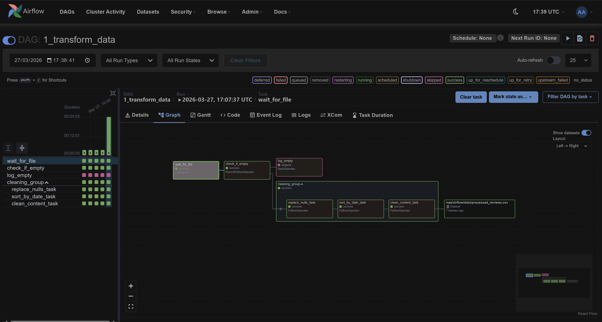
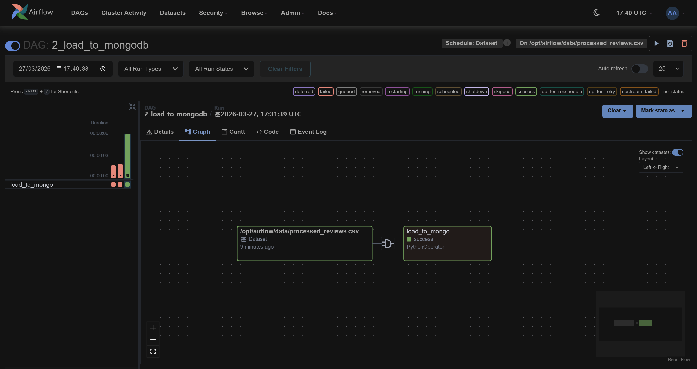
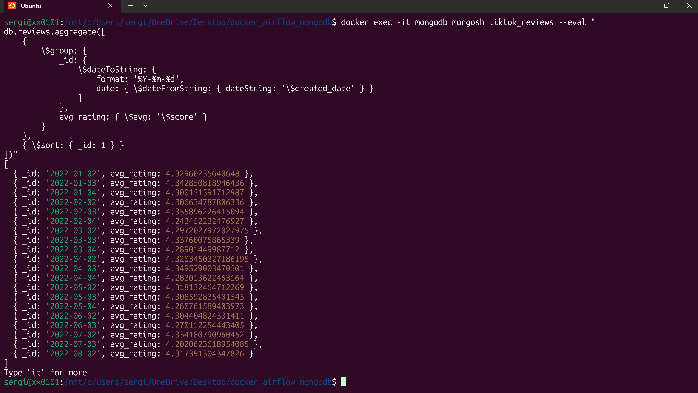

# ETL Pipeline using Airflow, MongoDB & Docker

---

## 🏗️ Architecture Overview
This project leverages **Docker** to orchestrate a multi-stage data pipeline that transforms raw TikTok reviews into a structured, cleaned format for NoSQL storage.

### 🔄 DAG 1: Data Transformation (`1_transform_data`)
* **Owner:** S.T - BigData
* **Sensor:** Monitors the `/data` folder for `tiktok_google_play_reviews.csv`.
* **Branching:** A `BranchPythonOperator` checks if the file is empty.
    * **If Empty:** Routes to `log_empty` and terminates.
    * **If Data:** Routes to the **Cleaning TaskGroup**.
* **TaskGroup (Transformation):**
    * ✅ **Null Handling:** Replaces `null` values with `-`.
    * 📅 **Sorting:** Orders all records by `created_date`.
    * ✨ **Sanitization:** Removes emojis and special characters via Regex.
* **Dataset Outlet:** Updates the `processed_reviews.csv` Dataset to signal completion.

---

## 📸 Data Transformation Pipeline Visualization

### 📥 DAG 2: MongoDB Loader (`2_load_to_mongodb`)
* **Owner:** S.T - BigData
* **Data-Aware Trigger:** Automatically starts only when the first DAG successfully updates the processed dataset.
* **NoSQL Load:** Moves the finalized, cleaned data into a MongoDB collection.

---

## 📸 MongoDB Loader Pipeline Visualization

---

## 📈 MongoDB Analytics
Once the pipeline completes, the following insights can be extracted using **MongoDB Compass** or `mongosh`:

| Query Goal | MongoDB Logic (Aggregation) |
| :--- | :--- |
| **Top 5 Comments** | `[{$group: {_id: "$content", count: {$sum: 1}}}, {$sort: {count: -1}}, {$limit: 5}]` |
| **Short Reviews** | `{$expr: {$lt: [{$strLenCP: {$toString: "$content"}}, 5]}}` |
| **Daily Avg Rating** | `[{$group: {_id: "$created_date", avg: {$avg: "$score"}}}, {$sort: {_id: 1}}]` |

## 📸 MongoDB Analytics Visualization

---

## 🛠️ Quick Setup
1.  **Spin up containers:** Run `docker-compose up -d`.
2.  **Configure Airflow:** Create a `File (path)` connection named `fs_default` pointing to `/opt/airflow/data`.
3.  **Process Data:** Place `tiktok_google_play_reviews.csv` into your local `/data` folder to trigger the pipeline.

